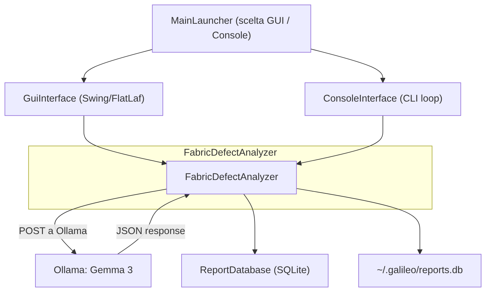

# GALILEO-ITA: analizzatore di difetti nei tessuti

[](https://www.java.com/)
[](https://docs.oracle.com/javase/tutorial/uiswing/)
[](https://ollama.ai/)
[](https://www.sqlite.org/)

Software desktop in Java sviluppato durante il percorso PCTO presso Galileo Italia SRL. Data la foto di un tessuto, il programma usa un modello linguistico multimodale (via Ollama) per individuare e descrivere i difetti presenti, producendo un report con localizzazione, gravità e note tecniche.

## Caratteristiche

- **Analisi AI su immagine**: invia la foto a un LLM multimodale (Gemma 3) con un prompt da esperto di controllo qualità tessile; il modello elenca i difetti con nome tecnico, posizione e gravità (lieve/moderata/grave).
- **Doppia interfaccia**: GUI in Swing (FlatLaf dark theme) e interfaccia a riga di comando.
- **Preprocessing delle immagini**: validazione del formato, limite di 10 MB, downscale a 512 px e codifica JPEG base64 prima dell'invio.
- **Cronologia e cache**: ogni report viene salvato in SQLite; i risultati vengono cachati per immagine e tipo di tessuto.
- **Esportazione report**: salvataggio del report in un file `.txt` dalla GUI.
- **Parametri del modello ottimizzati**: temperatura bassa (0.05), contesto di 2048 token, penalty di ripetizione per output stabili.

## Tecnologie

- **Java 11+** — API usate; build e runtime verificati con JDK 24
- **Swing & FlatLaf** — interfaccia grafica desktop con tema scuro
- **Ollama & Gemma 3** — vision-language model locale per l'analisi dei difetti
- **java.net.http.HttpClient** — comunicazione asincrona con l'API del server Ollama
- **Jackson 2.15** — parsing e serializzazione JSON per i report diagnostici
- **SQLite JDBC** — database locale per persistenza, cronologia e cache
- **Apache Ant & NetBeans** — ambiente di sviluppo e build system per il packaging JAR

## Uso

1. Avvia Ollama e assicurati che il modello sia disponibile.
2. Esegui il programma: scegli **1** per la GUI o **2** per la console.
3. Nella GUI: seleziona il tipo di tessuto, carica un'immagine (`jpg|jpeg|png|bmp|gif`) e premi **Analizza**.
4. Il report viene mostrato con il tempo di elaborazione. Puoi **pulire** la sessione, aprire la **cronologia** o **salvare il report** su file.
5. Nella console: inserisci il percorso dell'immagine e il tipo di tessuto; il report viene stampato a terminale.

## Installazione

Prerequisiti:

- **JDK 11+** (`java -version`)
- **Ollama** installato e in esecuzione su `localhost:11434` con il modello vision scaricato

```bash
ollama serve
ollama pull gemma3:1b   # oppure gemma3:4b / qwen2.5vl:3b
```

Compilazione ed esecuzione:

```bash
git clone https://github.com/St0rmosu/GALILEO-ITA.git
cd GALILEO-ITA
ant clean compile run        # via Ant
# oppure apri il progetto in NetBeans e premi Run
```

In alternativa, esegui il jar compilato (richiede la build già eseguita):

```bash
ant clean compile
java -cp "dist/PCTO1.jar:lib/*" com.mycompany.pcto.MainLauncher
```

> Nota: `dist/lib/` contiene solo i jar Jackson. FlatLaf e SQLite JDBC non sono copiati nella distribuzione, quindi il jar richiede librerie aggiuntive per girare.

## Architettura

L'applicazione è organizzata in un unico package (`com.mycompany.pcto`) con separazione tra interfaccia, logica AI e persistenza:



L'utente sceglie un'immagine e un tipo di tessuto. Il sistema controlla la cache in SQLite; se il risultato è assente, `FabricDefectAnalyzer` prepara l'immagine, costruisce il prompt e chiama Ollama. Il report viene mostrato, salvato nella cronologia e cachato.

## Documentazione API

Il programma comunica in locale con l'API nativa di Ollama:

| Endpoint | Metodo | Payload Body |
|---|---|---|
| `http://localhost:11434/api/chat` | `POST` | `{"model": "gemma3:1b", "messages": [{"role": "user", "content": "...", "images": ["<base64>"]}], "stream": false, "options": {"temperature": 0.05}}` |

- `model`: `gemma3:1b` / `gemma3:4b` / `qwen2.5vl:3b`.
- `messages[0].images`: array con la foto codificata in JPEG base64 (downscale a 512 px).
- `options`: `temperature: 0.05`, `num_predict: 1024`, `num_ctx: 2048`, `top_k: 20`, `top_p: 0.7`, `repeat_penalty: 1.1`.
- Risposta: campo `message.content` con il report diagnostico.

> Nota sul modello: il codice usa `gemma3:1b`, mentre README e CLI citano `gemma3:4b` e la GUI mostra "Powered by Qwen 2.5 VL". Allinea il nome nel codice e nell'UI alla versione che usi davvero.

## Struttura del progetto

```
GALILEO-ITA/
├── src/com/mycompany/pcto/
│   ├── MainLauncher.java        # Entry point con menu (1=GUI, 2=Console, 3=Exit)
│   ├── GuiInterface.java        # Interfaccia Swing: analisi, cronologia, salvataggio
│   ├── ConsoleInterface.java    # Flusso CLI interattivo
│   ├── FabricDefectAnalyzer.java# Core AI: preprocessing, HTTP, parsing JSON
│   └── ReportDatabase.java      # Persistenza SQLite (reports + cache)
├── lib/                         # Dipendenze: flatlaf, jackson, sqlite-jdbc
├── build.xml                    # Build Ant (importa nbproject/build-impl.xml)
├── nbproject/                   # Metadati di progetto NetBeans
├── dist/                        # Distribuzione (PCTO1.jar + lib/)
└── manifest.mf
```

## Limitazioni e sviluppi futuri

- `build/built-jar.properties` contiene un percorso assoluto residuo della macchina di sviluppo.
- Il report del modello non è strutturato (testo libero); un output JSON con difetti tipizzati migliorerebbe il downstream.
- Prossimi passi: parsing strutturato del report, supporto batch di più immagini, integrazione OCR per etichette, packaging con `jlink`/`jpackage` per un installer nativo.

---

*Sviluppato da Lorenzo Recchia & Team PCTO @ IISS Luigi Dell'Erba*
